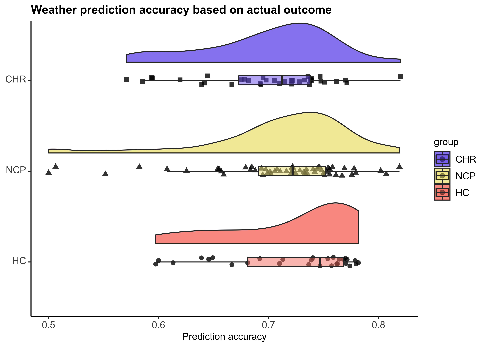

WPT data analysis\_prelim
================
Jadyn Park
3/22/2022

``` r
## clear environment
rm(list = ls())

## load libraries
library(knitr); library(kableExtra); library(dplyr); library(ggplot2); library(ez); library(readr); source("~/Desktop/WPT/summarySEwithin2.R")

## merge .csv files nested in folders to a master spreadsheet
  ## merge with py because pandas is superior 
  ## in jupyter notebook: 

    # import pandas as pd
    # import glob
    # 
    # # create empty dataframe
    # 
    # res = pd.DataFrame()
    # 
    # # name file as directory
    # # append file to empty dataframe
    # 
    # for direc in glob.glob("/Users/Jadyn/Desktop/WPT/np/*"):
    #     fil = pd.read_csv(direc)
    #     res = res.append(fil)
    # 
    # res.to_csv("WPT_master_CHR.csv")

## import csv files
chr_master <- read.csv("~/Desktop/WPT/WPT_master_CHR.csv", header=T)
hc_master <- read.csv("~/Desktop/WPT/WPT_master_HC.csv", header=T)
ncp_master <- read.csv("~/Desktop/WPT/WPT_master_NCP.csv", header=T)

all_master <- rbind(chr_master, hc_master)
all_master <- rbind(all_master, ncp_master)
```

``` r
## quick view of the data structure:
head(chr_master)
```

    ##   subnum trial config c1 c2 c3 c4 sampleprob rainprob prob2   time    rt
    ## 1   3049     1      J  1  0  1  0      0.064     0.82  0.82  94887 12570
    ## 2   3049     2      D  0  1  0  0      0.084     0.62  0.62 109001  2024
    ## 3   3049     3      J  1  0  1  0      0.064     0.82  0.82 112073  1752
    ## 4   3049     4      C  0  0  1  1      0.087     0.10  0.10 114874  1382
    ## 5   3049     5      L  1  1  0  0      0.087     0.90  0.90 117305  1040
    ## 6   3049     6      M  1  1  0  1      0.032     0.57  0.57 119386  3623
    ##       resp outcome correct
    ## 1 <rshift>       1       0
    ## 2 <lshift>       1       1
    ## 3 <lshift>       1       1
    ## 4 <rshift>       0       1
    ## 5 <lshift>       1       1
    ## 6 <rshift>       0       1

``` r
  ## subnum: subject ID
  ## trial: trial number (1-350)
  ## config: patterns of cues (14 patterns; A-N)
  ## c1-c4: cue (1=present, 0=absent)
  ## sampleprob: fixed probability of encountering pattern 
  ## rainprob: fixed probability that the encountered pattern results in rain
  ## time: time of response
  ## rt: reaction time (in ms)
  ## resp: button press (rshift, lshift; rshift=sun=0, lshift=rain=1)
  ## outcome: actual weather outcome (1=rain, 0=sun)
  ## correct: accuracy (0=inaccurate, 1=accurate)

## mutate 'resp' variable such that <rshift> is coded as 0, <lshift> is coded as 1
all_master <- all_master %>% mutate(resp=ifelse(resp=="<rshift>", 0, 1))

## omit irrelevant variables
all_master <- all_master %>% select(-prob2, -time)
```

*Probability Structure of the Task*. For each configuration, each card
could be present (1) or absent (0). The all-present (1111) and
all-absent (0000) patterns were never used. The overall probability of
rain, given by summing P(config) \* P(rain\|config) for all patterns, is
50%.

<table class="table table-striped table-bordered" style="margin-left: auto; margin-right: auto;">
<thead>
<tr>
<th style="text-align:left;">
config
</th>
<th style="text-align:right;">
cue1
</th>
<th style="text-align:right;">
cue2
</th>
<th style="text-align:right;">
cue3
</th>
<th style="text-align:right;">
cue4
</th>
<th style="text-align:right;">
configprob
</th>
<th style="text-align:right;">
rainprob
</th>
</tr>
</thead>
<tbody>
<tr>
<td style="text-align:left;">
A
</td>
<td style="text-align:right;">
0
</td>
<td style="text-align:right;">
0
</td>
<td style="text-align:right;">
0
</td>
<td style="text-align:right;">
1
</td>
<td style="text-align:right;">
0.140
</td>
<td style="text-align:right;">
0.15
</td>
</tr>
<tr>
<td style="text-align:left;">
B
</td>
<td style="text-align:right;">
0
</td>
<td style="text-align:right;">
0
</td>
<td style="text-align:right;">
1
</td>
<td style="text-align:right;">
0
</td>
<td style="text-align:right;">
0.084
</td>
<td style="text-align:right;">
0.38
</td>
</tr>
<tr>
<td style="text-align:left;">
C
</td>
<td style="text-align:right;">
0
</td>
<td style="text-align:right;">
0
</td>
<td style="text-align:right;">
1
</td>
<td style="text-align:right;">
1
</td>
<td style="text-align:right;">
0.087
</td>
<td style="text-align:right;">
0.10
</td>
</tr>
<tr>
<td style="text-align:left;">
D
</td>
<td style="text-align:right;">
0
</td>
<td style="text-align:right;">
1
</td>
<td style="text-align:right;">
0
</td>
<td style="text-align:right;">
0
</td>
<td style="text-align:right;">
0.084
</td>
<td style="text-align:right;">
0.62
</td>
</tr>
<tr>
<td style="text-align:left;">
E
</td>
<td style="text-align:right;">
0
</td>
<td style="text-align:right;">
1
</td>
<td style="text-align:right;">
0
</td>
<td style="text-align:right;">
1
</td>
<td style="text-align:right;">
0.064
</td>
<td style="text-align:right;">
0.18
</td>
</tr>
<tr>
<td style="text-align:left;">
F
</td>
<td style="text-align:right;">
0
</td>
<td style="text-align:right;">
1
</td>
<td style="text-align:right;">
1
</td>
<td style="text-align:right;">
0
</td>
<td style="text-align:right;">
0.047
</td>
<td style="text-align:right;">
0.50
</td>
</tr>
<tr>
<td style="text-align:left;">
G
</td>
<td style="text-align:right;">
0
</td>
<td style="text-align:right;">
1
</td>
<td style="text-align:right;">
1
</td>
<td style="text-align:right;">
1
</td>
<td style="text-align:right;">
0.041
</td>
<td style="text-align:right;">
0.21
</td>
</tr>
<tr>
<td style="text-align:left;">
H
</td>
<td style="text-align:right;">
1
</td>
<td style="text-align:right;">
0
</td>
<td style="text-align:right;">
0
</td>
<td style="text-align:right;">
0
</td>
<td style="text-align:right;">
0.140
</td>
<td style="text-align:right;">
0.85
</td>
</tr>
<tr>
<td style="text-align:left;">
I
</td>
<td style="text-align:right;">
1
</td>
<td style="text-align:right;">
0
</td>
<td style="text-align:right;">
0
</td>
<td style="text-align:right;">
1
</td>
<td style="text-align:right;">
0.058
</td>
<td style="text-align:right;">
0.50
</td>
</tr>
<tr>
<td style="text-align:left;">
J
</td>
<td style="text-align:right;">
1
</td>
<td style="text-align:right;">
0
</td>
<td style="text-align:right;">
1
</td>
<td style="text-align:right;">
0
</td>
<td style="text-align:right;">
0.064
</td>
<td style="text-align:right;">
0.82
</td>
</tr>
<tr>
<td style="text-align:left;">
K
</td>
<td style="text-align:right;">
1
</td>
<td style="text-align:right;">
0
</td>
<td style="text-align:right;">
1
</td>
<td style="text-align:right;">
1
</td>
<td style="text-align:right;">
0.032
</td>
<td style="text-align:right;">
0.43
</td>
</tr>
<tr>
<td style="text-align:left;">
L
</td>
<td style="text-align:right;">
1
</td>
<td style="text-align:right;">
1
</td>
<td style="text-align:right;">
0
</td>
<td style="text-align:right;">
0
</td>
<td style="text-align:right;">
0.087
</td>
<td style="text-align:right;">
0.90
</td>
</tr>
<tr>
<td style="text-align:left;">
M
</td>
<td style="text-align:right;">
1
</td>
<td style="text-align:right;">
1
</td>
<td style="text-align:right;">
0
</td>
<td style="text-align:right;">
1
</td>
<td style="text-align:right;">
0.032
</td>
<td style="text-align:right;">
0.57
</td>
</tr>
<tr>
<td style="text-align:left;">
N
</td>
<td style="text-align:right;">
1
</td>
<td style="text-align:right;">
1
</td>
<td style="text-align:right;">
1
</td>
<td style="text-align:right;">
0
</td>
<td style="text-align:right;">
0.041
</td>
<td style="text-align:right;">
0.79
</td>
</tr>
</tbody>
</table>

Given a configuration, there’s 10%, 15%, 18%, 21%, 38%, 43%, 50%, 57%,
62%, 79%, 82%, 85%, 90% chance of raining. In other words, some
configurations predict rain better than others. Therefore, it’s
important to track accuracy based on probable outcome, rather than
actual outcome.

``` r
## omit rainprob=.50 because it's just chance
no50 <- all_master %>% filter(config != "F" & config != "I")

## add variable 'probableoutcome' that indicates probable outcome for the pattern
## if rainprob >= .50, probable outcome = 1
no50 <- no50 %>% mutate(probableoutcome=ifelse(rainprob >= .50, 1, 0))

## add variable 'acc_prob' that indicates whether probable outcome was accurately predicted
no50 <- no50 %>% mutate(acc_prob=ifelse(resp==probableoutcome, 1, 0))
```

``` r
## add group status
  ## 3XXX = CHR
  ## 4XXX = HC
  ## 5XXX = NCP
df <- no50 %>% mutate(group=ifelse(subnum < 3999, "CHR",
                                         ifelse(3999 < subnum & subnum < 4999, "HC", "NCP")))

## average accuracy by group
accuracy <- df %>% group_by(group) %>% dplyr::summarise(acc_outcome=mean(correct),
                                                        acc_probable=mean(acc_prob))

accuracy <- accuracy[c(1,3,2),] #reordering of groups

knitr::kable(accuracy) %>% kable_styling(c("striped", "bordered", full_width = F))
```

<table class="table table-striped table-bordered" style="margin-left: auto; margin-right: auto;">
<thead>
<tr>
<th style="text-align:left;">
group
</th>
<th style="text-align:right;">
acc\_outcome
</th>
<th style="text-align:right;">
acc\_probable
</th>
</tr>
</thead>
<tbody>
<tr>
<td style="text-align:left;">
CHR
</td>
<td style="text-align:right;">
0.7011994
</td>
<td style="text-align:right;">
0.8097514
</td>
</tr>
<tr>
<td style="text-align:left;">
NCP
</td>
<td style="text-align:right;">
0.7109211
</td>
<td style="text-align:right;">
0.8306583
</td>
</tr>
<tr>
<td style="text-align:left;">
HC
</td>
<td style="text-align:right;">
0.7231488
</td>
<td style="text-align:right;">
0.8384150
</td>
</tr>
</tbody>
</table>

``` r
## create dataframe summarized by subject
bysubject <- df %>% group_by(group, subnum) %>% dplyr::summarise(acc_outcome=mean(correct),
                                                        acc_probable=mean(acc_prob))

## group differences significance testing
  ## CHR vs. HC
chr_vs_hc <- bysubject %>% filter(group != "NCP")
t.test(chr_vs_hc$acc_outcome~chr_vs_hc$group, var.equal=T)
```

    ## 
    ##  Two Sample t-test
    ## 
    ## data:  chr_vs_hc$acc_outcome by chr_vs_hc$group
    ## t = -1.504, df = 63, p-value = 0.1376
    ## alternative hypothesis: true difference in means is not equal to 0
    ## 95 percent confidence interval:
    ##  -0.051132933  0.007217429
    ## sample estimates:
    ## mean in group CHR  mean in group HC 
    ##         0.6994794         0.7214372

``` r
t.test(chr_vs_hc$acc_probable~chr_vs_hc$group, var.equal=T)
```

    ## 
    ##  Two Sample t-test
    ## 
    ## data:  chr_vs_hc$acc_probable by chr_vs_hc$group
    ## t = -1.0808, df = 63, p-value = 0.2839
    ## alternative hypothesis: true difference in means is not equal to 0
    ## 95 percent confidence interval:
    ##  -0.08035482  0.02394433
    ## sample estimates:
    ## mean in group CHR  mean in group HC 
    ##         0.8071263         0.8353315

``` r
  ## CHR vs. NCP
chr_vs_ncp <- bysubject %>% filter(group != "HC")
t.test(chr_vs_ncp$acc_outcome~chr_vs_ncp$group, var.equal=T)
```

    ## 
    ##  Two Sample t-test
    ## 
    ## data:  chr_vs_ncp$acc_outcome by chr_vs_ncp$group
    ## t = -0.83348, df = 89, p-value = 0.4068
    ## alternative hypothesis: true difference in means is not equal to 0
    ## 95 percent confidence interval:
    ##  -0.03806719  0.01556850
    ## sample estimates:
    ## mean in group CHR mean in group NCP 
    ##         0.6994794         0.7107288

``` r
t.test(chr_vs_ncp$acc_probable~chr_vs_ncp$group, var.equal=T)
```

    ## 
    ##  Two Sample t-test
    ## 
    ## data:  chr_vs_ncp$acc_probable by chr_vs_ncp$group
    ## t = -1.0352, df = 89, p-value = 0.3034
    ## alternative hypothesis: true difference in means is not equal to 0
    ## 95 percent confidence interval:
    ##  -0.06838342  0.02153493
    ## sample estimates:
    ## mean in group CHR mean in group NCP 
    ##         0.8071263         0.8305505

``` r
  ## NCP vs. HC
ncp_vs_hc <- bysubject %>% filter(group != "CHR")
t.test(ncp_vs_hc$acc_outcome~ncp_vs_hc$group, var.equal=T)
```

    ## 
    ##  Two Sample t-test
    ## 
    ## data:  ncp_vs_hc$acc_outcome by ncp_vs_hc$group
    ## t = 0.73178, df = 82, p-value = 0.4664
    ## alternative hypothesis: true difference in means is not equal to 0
    ## 95 percent confidence interval:
    ##  -0.01840186  0.03981868
    ## sample estimates:
    ##  mean in group HC mean in group NCP 
    ##         0.7214372         0.7107288

``` r
t.test(ncp_vs_hc$acc_probable~ncp_vs_hc$group, var.equal=T)
```

    ## 
    ##  Two Sample t-test
    ## 
    ## data:  ncp_vs_hc$acc_probable by ncp_vs_hc$group
    ## t = 0.21126, df = 82, p-value = 0.8332
    ## alternative hypothesis: true difference in means is not equal to 0
    ## 95 percent confidence interval:
    ##  -0.04023941  0.04980141
    ## sample estimates:
    ##  mean in group HC mean in group NCP 
    ##         0.8353315         0.8305505

``` r
## relevel so that the plot is presented in the order of CHR > NCP > HC
bysubject$group <- factor(bysubject$group, levels=c("HC", "NCP", "CHR"))

## plot group differences
outcome_plot <- 
  bysubject %>% 
  ggplot(aes(x = group, y = acc_outcome, fill = group)) + 
  geom_flat_violin(position = position_nudge(x = .2, y = 0),
                   alpha = .8) +
  geom_point(aes(shape = group),
             position = position_jitter(width = .05),
             size = 2, alpha = 0.8) +
  geom_boxplot(width = .1, outlier.shape = NA, alpha = 0.5) +
  coord_flip() +
  labs(title = "Weather prediction accuracy based on actual outcome",
       y = "Prediction accuracy") +
  theme_classic() +
  scale_fill_manual(values=c("#FA8072", "#F0E68C", "#7B68EE")) +
  guides(fill = guide_legend(reverse=TRUE), shape = FALSE) +
  raincloud_theme
outcome_plot
```

<!-- -->

``` r
probable_plot <- 
  bysubject %>% 
  ggplot(aes(x = group, y = acc_probable, fill = group)) + 
  geom_flat_violin(position = position_nudge(x = .2, y = 0),
                   alpha = .8) +
  geom_point(aes(shape = group),
             position = position_jitter(width = .05),
             size = 2, alpha = 0.8) +
  geom_boxplot(width = .1, outlier.shape = NA, alpha = 0.5) +
  coord_flip() +
  labs(title = "Weather prediction accuracy based on probable outcome",
       y = "Prediction accuracy") +
  theme_classic() +
  scale_fill_manual(values=c("#FA8072", "#F0E68C", "#7B68EE")) +
  guides(fill = guide_legend(reverse=TRUE), shape = FALSE) +
  raincloud_theme
probable_plot
```

<!-- -->
