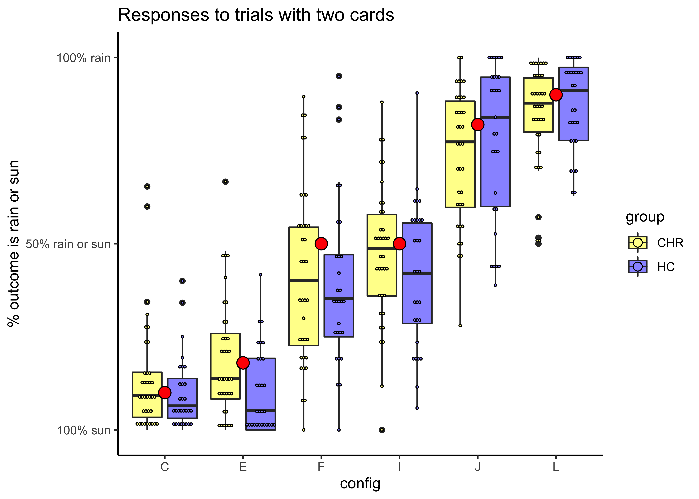

WPT data analysis_prelim
================
Jadyn Park
3/22/2022

``` r
## clear environment
rm(list = ls())

## load libraries
library(knitr); library(kableExtra); library(dplyr); library(ggplot2); library(ez); library(readr); library(lme4)

## merge .csv files nested in folders to a master spreadsheet
  ## merge with py because pandas is superior 
  ## in jupyter notebook: 

    # import pandas as pd
    # import glob
    # 
    # # create empty dataframe
    # 
    # res = pd.DataFrame()
    # 
    # # name file as directory
    # # append file to empty dataframe
    # 
    # for direc in glob.glob("/Users/Jadyn/Desktop/WPT/np/*"):
    #     fil = pd.read_csv(direc)
    #     res = res.append(fil)
    # 
    # res.to_csv("WPT_master_CHR.csv")

## import csv files
chr_master <- read.csv("~/Desktop/ADAPT/WPT/WPT_master_CHR.csv", header=T)
hc_master <- read.csv("~/Desktop/ADAPT/WPT/WPT_master_HC.csv", header=T)
ncp_master <- read.csv("~/Desktop/ADAPT/WPT/WPT_master_NCP.csv", header=T)

all_master <- rbind(chr_master, hc_master)
all_master <- rbind(all_master, ncp_master)
```

``` r
## quick view of the data structure:
head(chr_master)
```

    ##   subnum trial config c1 c2 c3 c4 sampleprob rainprob prob2   time    rt
    ## 1   3049     1      J  1  0  1  0      0.064     0.82  0.82  94887 12570
    ## 2   3049     2      D  0  1  0  0      0.084     0.62  0.62 109001  2024
    ## 3   3049     3      J  1  0  1  0      0.064     0.82  0.82 112073  1752
    ## 4   3049     4      C  0  0  1  1      0.087     0.10  0.10 114874  1382
    ## 5   3049     5      L  1  1  0  0      0.087     0.90  0.90 117305  1040
    ## 6   3049     6      M  1  1  0  1      0.032     0.57  0.57 119386  3623
    ##       resp outcome correct
    ## 1 <rshift>       1       0
    ## 2 <lshift>       1       1
    ## 3 <lshift>       1       1
    ## 4 <rshift>       0       1
    ## 5 <lshift>       1       1
    ## 6 <rshift>       0       1

``` r
  ## subnum: subject ID
  ## trial: trial number (1-350)
  ## config: patterns of cues (14 patterns; A-N)
  ## c1-c4: cue (1=present, 0=absent)
  ## sampleprob: fixed probability of encountering pattern 
  ## rainprob: fixed probability that the encountered pattern results in rain
  ## time: time of response
  ## rt: reaction time (in ms)
  ## resp: button press (rshift, lshift; rshift=sun=0, lshift=rain=1)
  ## outcome: actual weather outcome (1=rain, 0=sun)
  ## correct: accuracy (0=inaccurate, 1=accurate)

## mutate 'resp' variable such that <rshift> is coded as 0, <lshift> is coded as 1
all_master <- all_master %>% mutate(resp=ifelse(resp=="<rshift>", 0, 1))

## omit irrelevant variables
all_master <- all_master %>% select(-prob2, -time)

## add group info
all_master <- all_master %>% mutate(group=ifelse(subnum < 3999, "CHR",
                                         ifelse(3999 < subnum & subnum < 4999, "HC", "NCP")))
```

*Probability Structure of the Task*. For each configuration, each card
could be present (1) or absent (0). The all-present (1111) and
all-absent (0000) patterns were never used. The overall probability of
rain, given by summing P(config) \* P(rain\|config) for all patterns, is
50%.

<table class="table table-striped table-bordered" style="margin-left: auto; margin-right: auto;">
<thead>
<tr>
<th style="text-align:left;">
config
</th>
<th style="text-align:right;">
cue1
</th>
<th style="text-align:right;">
cue2
</th>
<th style="text-align:right;">
cue3
</th>
<th style="text-align:right;">
cue4
</th>
<th style="text-align:right;">
configprob
</th>
<th style="text-align:right;">
rainprob
</th>
</tr>
</thead>
<tbody>
<tr>
<td style="text-align:left;">
A
</td>
<td style="text-align:right;">
0
</td>
<td style="text-align:right;">
0
</td>
<td style="text-align:right;">
0
</td>
<td style="text-align:right;">
1
</td>
<td style="text-align:right;">
0.140
</td>
<td style="text-align:right;">
0.15
</td>
</tr>
<tr>
<td style="text-align:left;">
B
</td>
<td style="text-align:right;">
0
</td>
<td style="text-align:right;">
0
</td>
<td style="text-align:right;">
1
</td>
<td style="text-align:right;">
0
</td>
<td style="text-align:right;">
0.084
</td>
<td style="text-align:right;">
0.38
</td>
</tr>
<tr>
<td style="text-align:left;">
C
</td>
<td style="text-align:right;">
0
</td>
<td style="text-align:right;">
0
</td>
<td style="text-align:right;">
1
</td>
<td style="text-align:right;">
1
</td>
<td style="text-align:right;">
0.087
</td>
<td style="text-align:right;">
0.10
</td>
</tr>
<tr>
<td style="text-align:left;">
D
</td>
<td style="text-align:right;">
0
</td>
<td style="text-align:right;">
1
</td>
<td style="text-align:right;">
0
</td>
<td style="text-align:right;">
0
</td>
<td style="text-align:right;">
0.084
</td>
<td style="text-align:right;">
0.62
</td>
</tr>
<tr>
<td style="text-align:left;">
E
</td>
<td style="text-align:right;">
0
</td>
<td style="text-align:right;">
1
</td>
<td style="text-align:right;">
0
</td>
<td style="text-align:right;">
1
</td>
<td style="text-align:right;">
0.064
</td>
<td style="text-align:right;">
0.18
</td>
</tr>
<tr>
<td style="text-align:left;">
F
</td>
<td style="text-align:right;">
0
</td>
<td style="text-align:right;">
1
</td>
<td style="text-align:right;">
1
</td>
<td style="text-align:right;">
0
</td>
<td style="text-align:right;">
0.047
</td>
<td style="text-align:right;">
0.50
</td>
</tr>
<tr>
<td style="text-align:left;">
G
</td>
<td style="text-align:right;">
0
</td>
<td style="text-align:right;">
1
</td>
<td style="text-align:right;">
1
</td>
<td style="text-align:right;">
1
</td>
<td style="text-align:right;">
0.041
</td>
<td style="text-align:right;">
0.21
</td>
</tr>
<tr>
<td style="text-align:left;">
H
</td>
<td style="text-align:right;">
1
</td>
<td style="text-align:right;">
0
</td>
<td style="text-align:right;">
0
</td>
<td style="text-align:right;">
0
</td>
<td style="text-align:right;">
0.140
</td>
<td style="text-align:right;">
0.85
</td>
</tr>
<tr>
<td style="text-align:left;">
I
</td>
<td style="text-align:right;">
1
</td>
<td style="text-align:right;">
0
</td>
<td style="text-align:right;">
0
</td>
<td style="text-align:right;">
1
</td>
<td style="text-align:right;">
0.058
</td>
<td style="text-align:right;">
0.50
</td>
</tr>
<tr>
<td style="text-align:left;">
J
</td>
<td style="text-align:right;">
1
</td>
<td style="text-align:right;">
0
</td>
<td style="text-align:right;">
1
</td>
<td style="text-align:right;">
0
</td>
<td style="text-align:right;">
0.064
</td>
<td style="text-align:right;">
0.82
</td>
</tr>
<tr>
<td style="text-align:left;">
K
</td>
<td style="text-align:right;">
1
</td>
<td style="text-align:right;">
0
</td>
<td style="text-align:right;">
1
</td>
<td style="text-align:right;">
1
</td>
<td style="text-align:right;">
0.032
</td>
<td style="text-align:right;">
0.43
</td>
</tr>
<tr>
<td style="text-align:left;">
L
</td>
<td style="text-align:right;">
1
</td>
<td style="text-align:right;">
1
</td>
<td style="text-align:right;">
0
</td>
<td style="text-align:right;">
0
</td>
<td style="text-align:right;">
0.087
</td>
<td style="text-align:right;">
0.90
</td>
</tr>
<tr>
<td style="text-align:left;">
M
</td>
<td style="text-align:right;">
1
</td>
<td style="text-align:right;">
1
</td>
<td style="text-align:right;">
0
</td>
<td style="text-align:right;">
1
</td>
<td style="text-align:right;">
0.032
</td>
<td style="text-align:right;">
0.57
</td>
</tr>
<tr>
<td style="text-align:left;">
N
</td>
<td style="text-align:right;">
1
</td>
<td style="text-align:right;">
1
</td>
<td style="text-align:right;">
1
</td>
<td style="text-align:right;">
0
</td>
<td style="text-align:right;">
0.041
</td>
<td style="text-align:right;">
0.79
</td>
</tr>
</tbody>
</table>

**1. Examine performance by optimal outcome.**

Given a configuration, there’s 10%, 15%, 18%, 21%, 38%, 43%, 50%, 57%,
62%, 79%, 82%, 85%, 90% chance of raining. In other words, some
configurations predict rain better than others. Therefore, it’s
important to track accuracy based on probable outcome, rather than
actual outcome.

Each dot represents mean response for each participant; the red dots
represent the probability that the configuration predicted sun or rain
(this probability is fixed)

``` r
## summarize response by subject and config
summary_by_sub <- all_master %>% group_by(subnum, group, config) %>%
  dplyr::summarise(c1 = mean(c1),
                   c2 = mean(c2),
                   c3 = mean(c3),
                   c4 = mean(c4),
                   sampleprob = mean(sampleprob),
                   rainprob = mean(rainprob),
                   mean_rt = mean(rt),
                   mean_resp = mean(resp),
                   outcome = mean(outcome),
                   accuracy = mean(correct))

## response visualization
  ## remove NCP for now

summary_by_sub <- summary_by_sub %>% filter(group!="NCP")

  ## split by high rain and high sun

high_rain <- summary_by_sub %>% filter(rainprob >.51 | config=="F")
high_sun <- summary_by_sub %>% filter(rainprob < .49 | config=="I")
single_sub <- high_rain %>% filter(subnum=="3001")
single_sub_sun <- high_sun %>% filter(subnum=="3001")

high_rain_plot <- ggplot(high_rain, aes(x=config, y=mean_resp, fill=group)) +
  geom_boxplot(trim=FALSE, position=position_dodge(.9)) + 
  geom_dotplot(binaxis='y', stackdir='center', dotsize=.2, position=position_dodge(.9)) +
  geom_dotplot(data=single_sub, aes(x=config, y=rainprob), fill="red", binaxis='y', stackdir='center', position=position_dodge(.9)) +
  theme_classic() +
  labs(title="Responses to cards more predictive of rain than sun by group")

high_rain_plot + scale_fill_manual(values=c("#FFFF99", "#9999FF")) + 
  scale_y_continuous(name="% outcome is rain or sun", 
                   breaks=c(0, .5, 1), 
                   labels=c("100% sun", "50% rain or sun", "100% rain"))
```

<!-- -->

``` r
high_sun_plot <- ggplot(high_sun, aes(x=config, y=mean_resp, fill=group)) +
  geom_boxplot(trim=FALSE, position=position_dodge(.9)) + 
  geom_dotplot(binaxis='y', stackdir='center', dotsize=.2, position=position_dodge(.9)) +
  geom_dotplot(data=single_sub_sun, aes(x=config, y=rainprob), fill="red", binaxis='y', stackdir='center', position=position_dodge(.9)) +
  theme_classic() +
  labs(title="Responses to cards more predictive of sun than rain by group")

high_sun_plot + scale_fill_manual(values=c("#FFFF99", "#9999FF")) + 
  scale_y_continuous(name="% outcome is rain or sun", 
                   breaks=c(0, .5, 1), 
                   labels=c("100% sun", "50% rain or sun", "100% rain"))
```

<!-- -->

``` r
  ## split by cue types (single card, 2 cards, 3 cards)

ABDH <- c("A", "B", "D", "H")
CEFIJL <- c("C", "E", "F", "I", "J", "L")
GKMN <- c("G", "K", "M", "N")

one_card <- summary_by_sub %>% dplyr::filter(config %in% ABDH)
two_cards <- summary_by_sub %>% dplyr::filter(config %in% CEFIJL)
three_cards <- summary_by_sub %>% dplyr::filter(config %in% GKMN)

one_card_sub <- one_card %>% filter(subnum=="3001")
two_cards_sub <- two_cards %>% filter(subnum=="3001")
three_cards_sub <- three_cards %>% filter(subnum=="3001")

one_card_plot <- ggplot(one_card, aes(x=config, y=mean_resp, fill=group)) +
  geom_boxplot(trim=FALSE, position=position_dodge(.9)) + 
  geom_dotplot(binaxis='y', stackdir='center', dotsize=.2, position=position_dodge(.9)) +
  geom_dotplot(data=one_card_sub, aes(x=config, y=rainprob), fill="red", binaxis='y', stackdir='center', position=position_dodge(.9)) +
  theme_classic() +
  labs(title="Responses to single card cues")

one_card_plot + scale_fill_manual(values=c("#FFFF99", "#9999FF")) + 
  scale_y_continuous(name="% outcome is rain or sun", 
                   breaks=c(0, .5, 1), 
                   labels=c("100% sun", "50% rain or sun", "100% rain"))
```

<!-- -->

``` r
two_cards_plot <- ggplot(two_cards, aes(x=config, y=mean_resp, fill=group)) +
  geom_boxplot(trim=FALSE, position=position_dodge(.9)) + 
  geom_dotplot(binaxis='y', stackdir='center', dotsize=.2, position=position_dodge(.9)) +
  geom_dotplot(data=two_cards_sub, aes(x=config, y=rainprob), fill="red", binaxis='y', stackdir='center', position=position_dodge(.9)) +
  theme_classic() +
  labs(title="Responses to two card cues")

two_cards_plot + scale_fill_manual(values=c("#FFFF99", "#9999FF")) + 
  scale_y_continuous(name="% outcome is rain or sun", 
                   breaks=c(0, .5, 1), 
                   labels=c("100% sun", "50% rain or sun", "100% rain"))
```

<!-- -->

``` r
three_cards_plot <- ggplot(three_cards, aes(x=config, y=mean_resp, fill=group)) +
  geom_boxplot(trim=FALSE, position=position_dodge(.9)) + 
  geom_dotplot(binaxis='y', stackdir='center', dotsize=.2, position=position_dodge(.9)) +
  geom_dotplot(data=three_cards_sub, aes(x=config, y=rainprob), fill="red", binaxis='y', stackdir='center', position=position_dodge(.9)) +
  theme_classic() +
  labs(title="Responses to three card cues")

three_cards_plot + scale_fill_manual(values=c("#FFFF99", "#9999FF")) + 
  scale_y_continuous(name="% outcome is rain or sun", 
                   breaks=c(0, .5, 1), 
                   labels=c("100% sun", "50% rain or sun", "100% rain"))
```

<!-- -->

``` r
  ## split by predictability (highly predictive cards vs. difficult to predict cards)

ACFHLJ <- c("A", "C", "F", "H", "L", "J")
FIKH <- c("F", "I", "K", "H")

highly_predictive <- summary_by_sub %>% dplyr::filter(config %in% ACFHLJ)
unpredictive <- summary_by_sub %>% dplyr::filter(config %in% FIKH)

highly_predictive_sub <- highly_predictive %>% filter(subnum=="3001")
unpredictive_sub <- unpredictive %>% filter(subnum=="3001")

highly_predictive_plot <- ggplot(highly_predictive, aes(x=config, y=mean_resp, fill=group)) +
  geom_boxplot(trim=FALSE, position=position_dodge(.9)) + 
  geom_dotplot(binaxis='y', stackdir='center', dotsize=.2, position=position_dodge(.9)) +
  geom_dotplot(data=highly_predictive_sub, aes(x=config, y=rainprob), fill="red", binaxis='y', stackdir='center', position=position_dodge(.9)) +
  theme_classic() +
  labs(title="Responses to highly predictive cues (rain or sun prob > 85%)")

highly_predictive_plot + scale_fill_manual(values=c("#FFFF99", "#9999FF")) + 
  scale_y_continuous(name="% outcome is rain or sun", 
                   breaks=c(0, .5, 1), 
                   labels=c("100% sun", "50% rain or sun", "100% rain"))
```

<!-- -->

``` r
unpredictive_plot <- ggplot(unpredictive, aes(x=config, y=mean_resp, fill=group)) +
  geom_boxplot(trim=FALSE, position=position_dodge(.9)) + 
  geom_dotplot(binaxis='y', stackdir='center', dotsize=.2, position=position_dodge(.9)) +
  geom_dotplot(data=unpredictive_sub, aes(x=config, y=rainprob), fill="red", binaxis='y', stackdir='center', position=position_dodge(.9)) +
  theme_classic() +
  labs(title="Responses to cards less predictive cues (rain or sun prob ~50%")

unpredictive_plot + scale_fill_manual(values=c("#FFFF99", "#9999FF")) + 
  scale_y_continuous(name="% outcome is rain or sun", 
                   breaks=c(0, .5, 1), 
                   labels=c("100% sun", "50% rain or sun", "100% rain"))
```

<!-- -->

**2. Examine performance by learning.**

Performance using multi-level modeling

``` r
## Accuracy by task quartile
## stats
# model1 <- lmer(acc_outcome~1+(1|group), data=summary_by_sub)
# summary(model1)
```

**3. Examine performance by strategy.**

There are three main strategies (Gluck et al., 2001): singleton (relying
on a single card), one-cue (relyong on presence or absence of highly
predictive cards), multi-cue (relying on combination of multiple cards)
